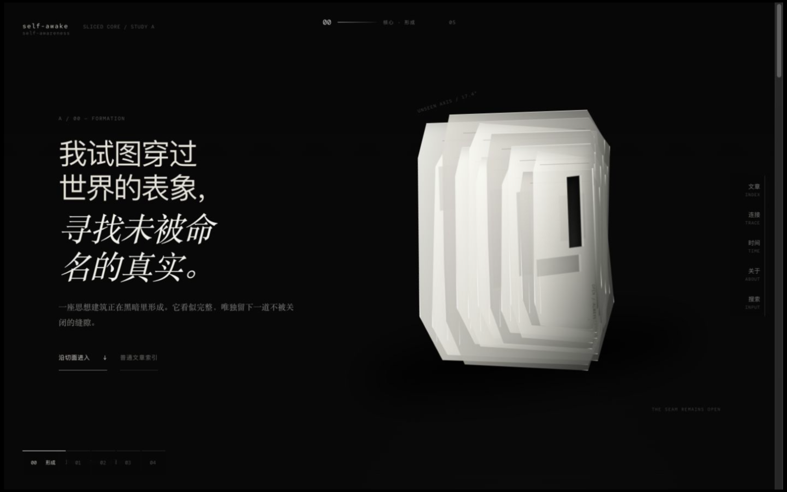
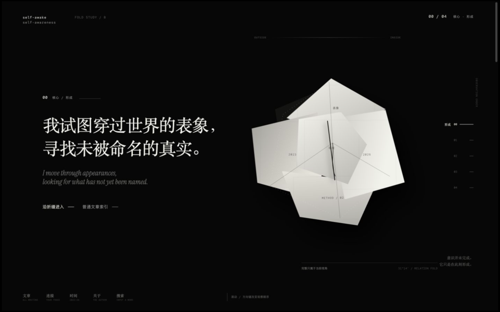
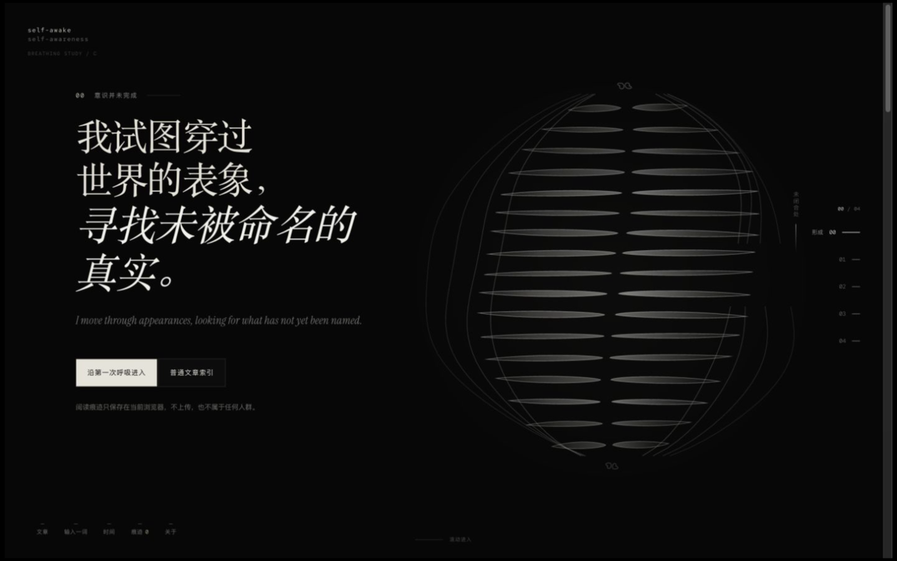
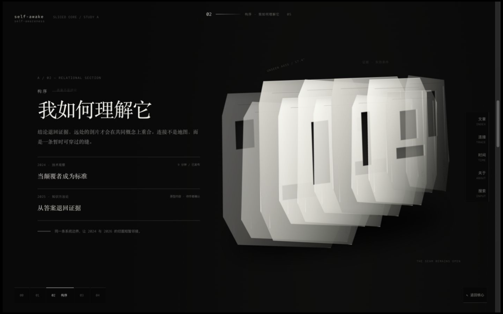
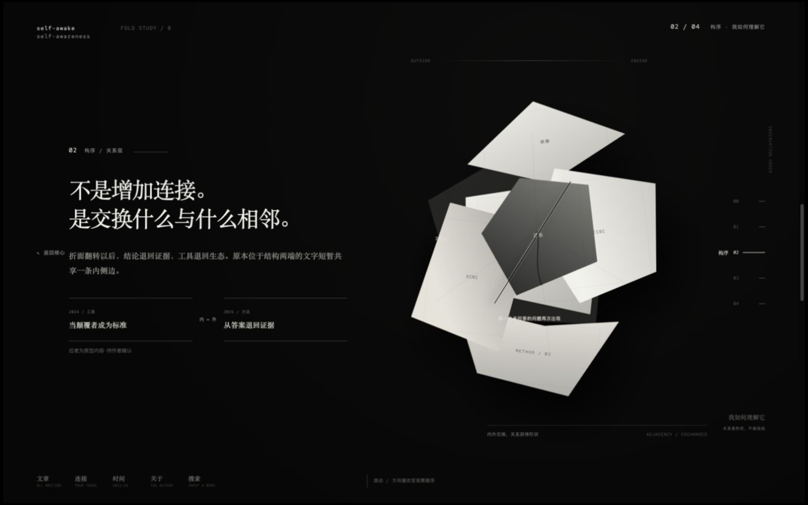
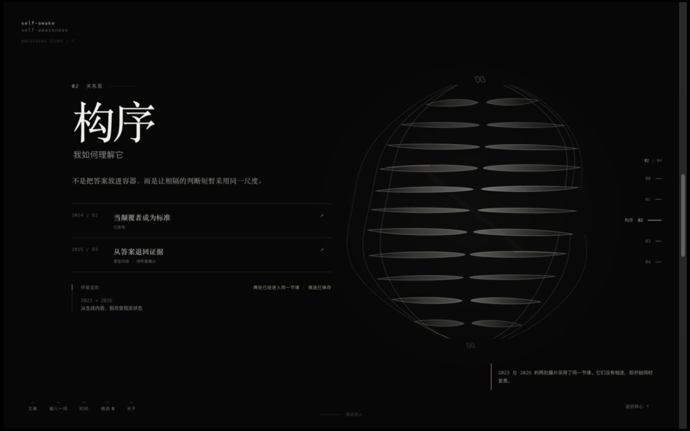
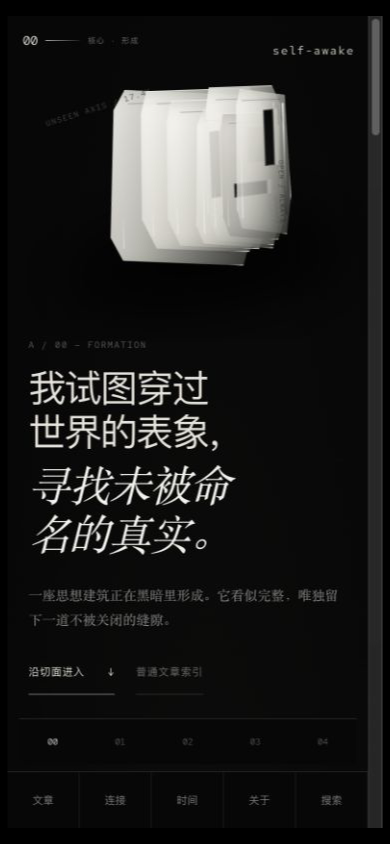
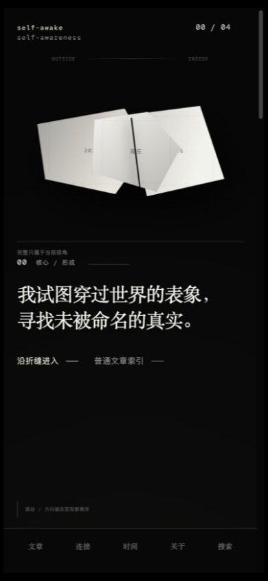
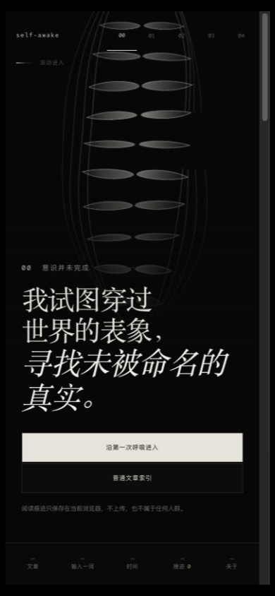

# Self-Awake 原型验证报告

验证日期：2026-07-12  
统一桌面视口：`1440 × 900`  
统一移动视口：`390 × 844`

## 验证范围

本轮只验证 `design-prototypes/`，没有把任何方向迁移进生产 `app/`、`components/` 或生产 CSS。三个原型均由仓库根目录的静态服务器直接运行，不依赖后端、CDN、远程字体或第三方脚本。

## 自动检查

| 检查 | A 切片核心 | B 折叠核心 | C 呼吸核心 |
| --- | --- | --- | --- |
| `node --check` | 通过 | 通过 | 通过 |
| PostCSS 完整解析 | 通过 | 通过 | 通过 |
| HTML ID 唯一 | 10 / 10 | 59 / 59 | 23 / 23 |
| HTML / CSS / JS / shared 内容 HTTP | 200 | 200 | 200 |
| `git diff --check` | 通过 | 通过 | 通过 |
| data-URI favicon | 有 | 有 | 有 |
| 远程运行依赖 | 无 | 无 | 无 |

共享内容包含 6 篇文章、6 个主题与 10 条有意义的关系。技术文章来自当前仓库；知识方法、自我觉察与本真文本明确标为“原型内容 · 待作者确认”。

## 真实浏览器验证

三个方向都在 Codex in-app Browser 中以相同条件实际运行，而不是只做静态代码推断。

### 共同通过项

- 首次形成过程可完成，也可以通过可聚焦按钮跳过。
- `00 形成 / 01 观象 / 02 构序 / 03 观心 / 04 见性` 的场景编号、语义内容与视觉状态一致。
- 滚轮连续意图最多推进一层；快速场景切换后没有编号或形体错位。
- 方向键、场景轨道、返回核心、普通文章索引、搜索与文章入口均可操作。
- 每版都实际打开过语义化 `dialog > article` 阅读层，正文包含 2–3 个以上段落与相关思想出口。
- 每版搜索“证据”均返回 2 条相关内容，搜索输入有明确 label 与结果状态。
- 每版都实际触发了约 2.4 秒停留显影，并把关系保存在当前浏览器。
- 路径变化会改变“见性”层的问题与私人痕迹说明。
- 页面控制台没有项目 JavaScript error 或 warning；data-URI favicon 消除了默认图标请求缺口。
- 页面隐藏暂停、DPR 上限、低性能几何减少与 `prefers-reduced-motion` 静态状态均在代码和状态分支中存在；降动效不删除语义内容。
- 原型不播放自动声音，也不请求设备方向、摄像头、麦克风或外部权限。

### 桌面 1440 × 900

| 方向 | Hero | 构序展开态 | 横向溢出 | 视觉层与内容 |
| --- | --- | --- | --- | --- |
| A | 通过 | 通过 | 无 | 白色切片与左侧声明清晰对峙；展开后沿单一轴线错位，不遮文章入口 |
| B | 通过 | 通过 | 无 | 完整折叠体在构序层交换内外邻接；内容区仍可读 |
| C | 通过 | 通过 | 无 | Canvas CSS 尺寸为 1440×900，内部 DPR 受 1.75 上限约束；提亮后骨白膜片不过曝 |

### 移动 390 × 844

| 方向 | 重构方式 | 横向溢出 | 首屏可用性 |
| --- | --- | --- | --- |
| A | 切片收束为上半屏单一紧凑剖面 | 无 | 声明、双入口、场景索引与底部功能均可达 |
| B | 折叠体改为横向剖面，标题降级为两行 | 无 | 不再出现单字孤行；普通索引和底部功能保持清晰 |
| C | Canvas 减少膜片与边界采样，形成上半屏呼吸截面 | 无 | 声明、双入口、隐私说明、滚动提示与底栏均在首屏内 |

## 截图证据

截图先在统一 CSS 视口中捕获，再只用纯黑补齐浏览器滚动条不计入截图造成的像素差；未缩放内容。最终文件均为真实 PNG，尺寸严格一致。

### 桌面 Hero

| A — 切片核心 | B — 折叠核心 | C — 呼吸核心 |
| --- | --- | --- |
|  |  |  |

### 桌面构序展开态

| A — 切片核心 | B — 折叠核心 | C — 呼吸核心 |
| --- | --- | --- |
|  |  |  |

### 移动 Hero

| A — 切片核心 | B — 折叠核心 | C — 呼吸核心 |
| --- | --- | --- |
|  |  |  |

## 仍然诚实保留的风险

- A 的空间质感依赖现代 CSS `clip-path`、sticky 与合成层；旧浏览器会失去深度，但语义场景与文章不消失。
- B 的抽象邻接需要短暂观察才会被理解，静态首屏可能先被读成纸质雕塑；滚动后语义会明显增强。
- C 的生命感主要来自慢速呼吸与同步，静态图的纪念碑感弱于 A/B；若继续加亮或加密，容易滑向器官、百叶或发光笼。
- 原型中的 `dialog` 依赖现代浏览器；无脚本/旧浏览器 fallback 仍保留文章摘要与返照问题，但不会拥有完整 modal 体验。
- 本地阅读痕迹当前用于验证叙事，没有跨设备同步，也不应在正式版中引入云端追踪。

